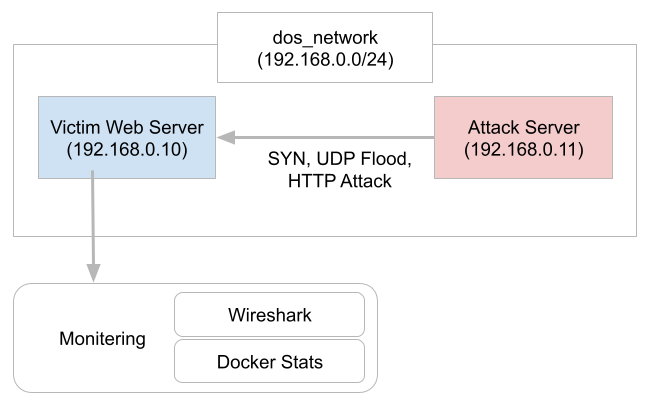

# DoS Environment Simulation (Education Purpose Only)
In this repository, I will introduce the most simple DoS simulation using Docker. For the victim server, we use nginx web server. We will check that web server received huge requests. In aditional, we also check the malicious packets which sent from the attacker. If we modify approprialye, we can fit to the paticluar virtual networking environment. (For instance, it is possible to change the CPU capability when we create the cotainer.) This project is mainly for observing the DoS attack packets.

Using Docker is not enogh to create the DoS testbed. There are lots of things we cannot observe. Please use KVM for more.



## Environmnet (Tested Environment)
Chip : Apple M2 <br>
OS : macOS 14.6.1（23G93）<br>
VM : Docker Desktop 27.1.1, build 6312585 <br>
Analysis : Wireshark 4.4.0

## Setup for the docker network
Docker network allow us to create the virtual network environment. In this project, I will use idepended network. It makes possible to set the IP address of the containers. I will make the network structure on 192.168.0.0/24. 

```bash
docker network create --subnet 192.168.0.0/24 dos_network
docker network ls | grep dos_network
```

## Setup for the docker containers
### Setup for the docker image
Docker containers need base docker image to identify the environmnet. In this project we use nginx for the victim web server. To begin with, we need to create the Dockerfile which has information of the environmnet. The Dockerfile's lines are as follows.

```bash
FROM nginx:stable-perl
COPY ./html /usr/share/nginx/html
EXPOSE 80
```

After creating the Dockerfile, we will make the new docker image based on the Dockerfile. We create the victim server first. 

```bash
docker pull nginx:stable-perl
docker build -t nginx-dos:victim ./victim/.
```

Next, we will prepare the attack server.
```bash
docker pull kalilinux/kali-rolling:latest
docker build -t kali-dos:attack ./attack/.
```

### Setup for the docker container
For each container, we need to create by using image. Here's the way to create the docker container for victim server.

```bash
docker create -it --name victim-server --network dos_network --ip 192.168.0.10 -p 8080:80 nginx-dos:victim
docker start victim-server
```
Also we will prepare for the attack server.

```bash
docker create -it --name attack-server --network dos_network --ip 192.168.0.11 kalilinux/kali-rolling:latest
docker start attack-server
```

### DoS Attack Simulation
For the attack simulation, we will use SYN Flood [2], UDP Flood [3] and reflection attack.
- SYN Flood
- UDP Flood
- Reflection Attack
- HTTP Attack (Kali and Playwright)


 From this process, we recommend you to use double terminals for each container.

```bash
docker exec -it attack-server bash
hping3 --flood --rand-source　--udp -p 8080 192.168.0.10

```
For the victim server
```bash
docker exec -it victim-server bash
tcpdump
```
### Analysis for the malicious packets
From Docker Desktop, it is possible to see the stats. First, we will use docker stats [4]. By using from docker desktop, it is possible to see it clealy as follows.


Second, we will see every packets by using TCPdump and Wireshark.
```bash
tcpdump port 8080 -w capture.pcap
```
```bash
docker cp [Container ID]:/capture.pcap .
```

### Close the docker containers
After finishing, please close the containers and stop the services.
```bash
docker stop
```
## Acknowledgement
Thank you very much for the communities. 

## References
1. Hping3, https://www.kali.org/tools/hping3/
1. SYN Flood, https://www.cloudflare.com/learning/ddos/syn-flood-ddos-attack/
1. UDP Flood, https://www.cloudflare.com/learning/ddos/udp-flood-ddos-attack/
1. Docker, "How to Monitor Container Memory and CPU Usage in Docker Desktop", https://www.docker.com/blog/how-to-monitor-container-memory-and-cpu-usage-in-docker-desktop/
1. Slow HTTP Dos, https://www.kali.org/tools/slowhttptest/
1. Playwright, https://playwright.dev/

